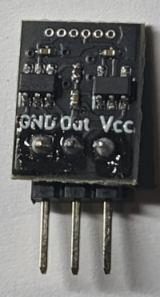
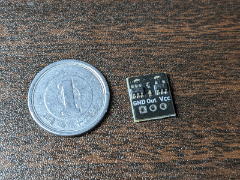
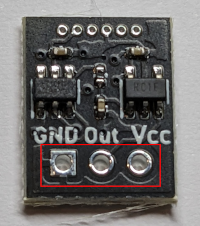

# noise-guy kit

[Document in Japanese](README_ja.md)

Tiny noise generator made by ATTiny10

# Kit contents

- Pre-assembled/programmed circuit board
- 1x3 pin vertical header

# How to assemble

Solder the 1x3 pin.

# How to use

- Connect power source. This product use ATTiny10 with 8MHz configuration. Vcc must be within the range between 2.7V - 5.5V(cf. ATtiny10 datasheet)
- Add DC Cut capacitor to "Out" terminal externally, to meet your specification(typically 100uF - 470uF).

