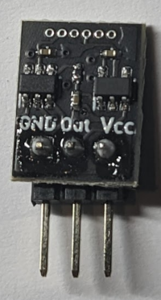

# ノイズ野郎キット

ノイズ野郎はATTiny10による超小型ホワイトノイズジェネレータです。

# キットの内容

- 組みたて/書きこみ済みの基板
- 1x3 ピンヘッダ

# 組みたてかた

1x3 ピンヘッダをはんだづけします。

# 使い方

- 電源を繋ぎます。ATTiny10は8MHzで動作します。データシートによると、電源電圧は 2.7V - 5.5Vの範囲である必要があります。
- DCカット用のコンデンサを、必要に応じて出力に追加してください(100uF - 470uF程度)
